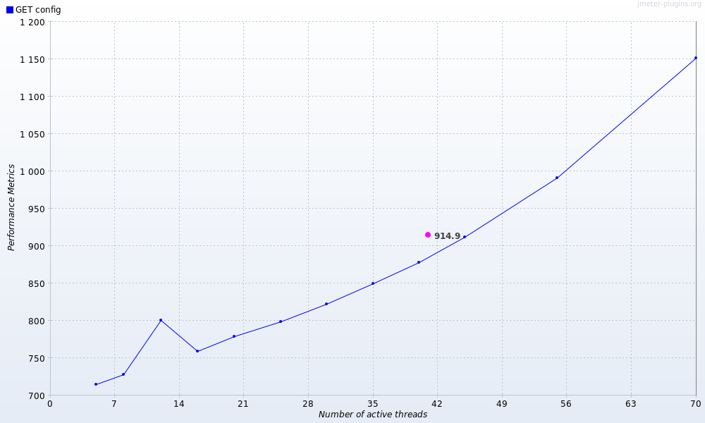
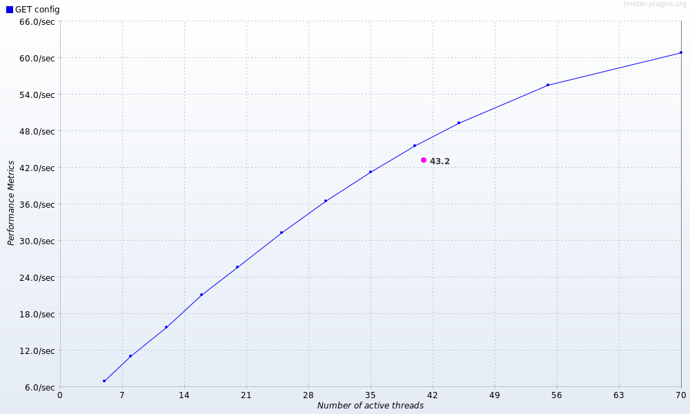

# Результаты стресс-тестирования

Цель — для выбранной конфигурации **cfg2 ($3600)** определить нагрузку, при которой время отклика перестаёт укладываться в SLA **840 мс**, и построить график зависимости времени отклика от нагрузки. Методика — [methodology.md](methodology.md). Выбор cfg2 обоснован в [load-results.md](load-results.md).

## 1. Условия прогона

Серия отдельных прогонов с растущей целевой нагрузкой. Для нагрузки выше номинала число потоков увеличивается (при росте времени отклика `R` падает потолок `N/R`, см. [theory.md](theory.md#32-закон-литтла)). Каждый уровень — 75 с, прогрев 15 с исключён, тайминги по успешным сэмплам.

| Параметр | Значение |
|---|---|
| Конфигурация | cfg2 ($3600) |
| Целевая нагрузка | 100 … 1500 запр./мин |
| Потоки | 5 … 70 (под каждый уровень) |
| Длительность уровня | 75 с |
| Метрика SLA | время отклика ≤ 840 мс |

## 2. Сводные результаты

Время отклика в миллисекундах (по успешным HTTP 200 сэмплам, прогрев исключён, [metrics.sh](../metrics.sh)):

| target, запр./мин | потоков | факт. запр./мин | avg | P95 | max | err% (503) | SLA ≤ 840? |
|---:|---:|---:|---:|---:|---:|---:|:--:|
| 100 | 5 | 101 | 714 | 715 | 722 | 0.0 | ✓ |
| 200 | 8 | 200 | 728 | 729 | 736 | 0.0 | ✓ |
| 300 | 12 | 300 | 798¹ | 751 | 2743¹ | 0.0 | ✓ |
| 400 | 16 | 401 | 759 | 759 | 768 | 0.0 | ✓ |
| 500 | 20 | 500 | 778 | 779 | 786 | 0.0 | ✓ |
| 600 | 25 | 600 | 799 | 800 | 806 | 0.0 | ✓ |
| **700** | 30 | 698 | 822 | 823 | 830 | 0.0 | **✓ (последний проходящий)** |
| **800** | 35 | 800 | 849 | 850 | 857 | 0.0 | **✗ (первый превышающий)** |
| 900 | 40 | 896 | 878 | 879 | 886 | 0.0 | ✗ |
| 1000 | 45 | 1001 | 912 | 914 | 925 | 0.0 | ✗ |
| 1200 | 55 | 1200 | 991 | 994 | 1002 | 0.0 | ✗ |
| 1500 | 70 | 1497 | 1151 | 1156 | 1317 | 0.0 | ✗ |

¹ На уровне 300 запр./мин зафиксирован кратковременный транзиент: несколько запросов ~2.6 с (P99 = 2614, max = 2743), что завысило среднее (798) относительно соседних уровней. Робастная метрика P95 = 751 мс при этом согласуется с трендом (между 729 и 759). Транзиент не влияет на вывод о пороге.

## 3. График «время отклика vs нагрузка»

Построен средствами JMeter (плагин `jpgc-graphs-vs`, CMDRunner, headless). Ось X — число активных пользователей-потоков (мера нагрузки; соответствие запр./мин — в таблице выше), ось Y — время отклика, мс.

Зависимость монотонно возрастающая: от ~715 мс при 5 потоках (100 запр./мин) до ~1150 мс при 70 потоках (1500 запр./мин). Порог SLA 840 мс пересекается в районе **35 потоков ≈ 800 запр./мин**.

Дополнительно — пропускная способность от нагрузки (показывает, что сервер продолжает обслуживать запросы, насыщения-обвала нет):

Фактическая пропускная способность растёт с нагрузкой (до ~61 запр./с ≈ 3660 запр./мин при 70 потоках), слегка замедляя рост — сервер деградирует по времени отклика, а не отказами.

## 4. Анализ

- **Время отклика растёт монотонно с нагрузкой** и очень детерминировано (avg ≈ P95 ≈ max на каждом уровне), поэтому все три метрики дают согласованный порог.
- **Граница SLA (840 мс) — между 700 и 800 запр./мин:**
  - при **700 запр./мин** все метрики ещё в норме (avg 822, P95 823, max 830 ≤ 840) — **последний проходящий уровень**;
  - при **800 запр./мин** все метрики уже превышают порог (avg 849, P95 850, max 857 > 840) — **первый нарушающий уровень**.
- **HTTP 503 не зафиксированы** ни на одном уровне вплоть до 1500 запр./мин (15-кратное превышение номинала): доля ошибок везде 0 %. Сервер не отвергает запросы при перегрузке в исследованном диапазоне, а обслуживает их с растущей задержкой. Таким образом, для cfg2 ограничивающим является именно критерий времени отклика, а не отказы.
- Пропускная способность не выходит на «полку» и не падает — точка насыщения по throughput в диапазоне до 1500 запр./мин не достигнута; ограничение наступает раньше — по SLA времени отклика.

## 5. Вывод

> **Выбранная конфигурация cfg2 ($3600) перестаёт удовлетворять требованию по максимальному времени обработки запроса (≤ 840 мс) при нагрузке ≈ 800 запр./мин** (по всем трём метрикам — avg, P95, max). Последний уровень, на котором SLA соблюдается, — **700 запр./мин** (max 830 мс).
>
> Это в **8 раз** превышает номинальную нагрузку варианта (100 запр./мин), при которой cfg2 работает с запасом ≈ 119 мс до порога. Ответы HTTP 503 (перегрузка) в диапазоне до 1500 запр./мин не наблюдались — сервер деградирует постепенно по времени отклика.
