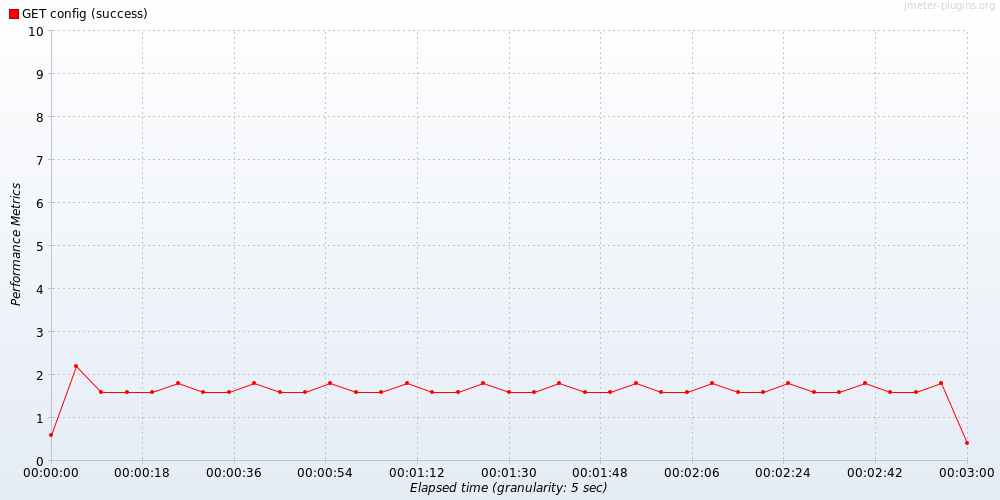
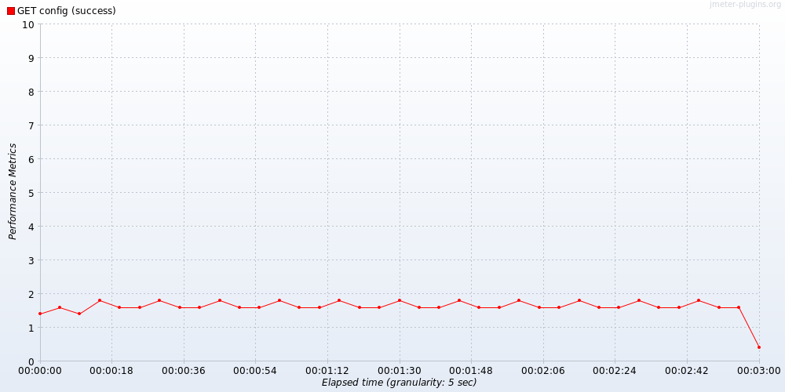
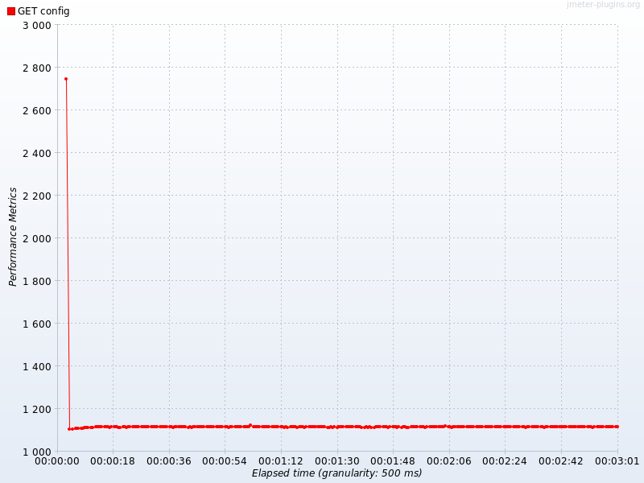
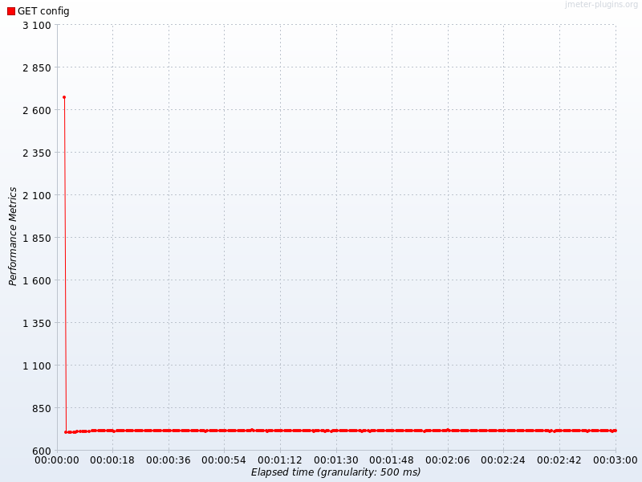
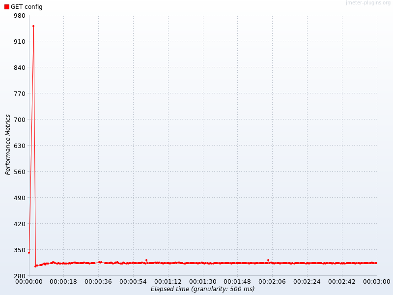

# 1. Текст задания

С помощью программного пакета Apache JMeter провести нагрузочное и стресс-тестирование веб-приложения в соответствии с вариантом задания.

В ходе нагрузочного тестирования необходимо протестировать 3 конфигурации аппаратного обеспечения и выбрать среди них наиболее дешёвую, удовлетворяющую требованиям по максимальному времени отклика приложения при заданной нагрузке (в соответствии с вариантом).

В ходе стресс-тестирования необходимо определить, при какой нагрузке выбранная на предыдущем шаге конфигурация перестаёт удовлетворять требованиям по максимальному времени отклика. Для этого необходимо построить график зависимости времени отклика приложения от нагрузки.

Если запрос содержит некорректные параметры, сервер возвращает HTTP 403. Если приложение не справляется с нагрузкой, сервер возвращает HTTP 503.

**Параметры тестируемого веб-приложения (вариант):**

| Параметр | Значение |
|---|---|
| URL конфигурации 1 ($3000) | `http://stload.se.ifmo.ru:8080?token=519244622&user=-1333019307&config=1` |
| URL конфигурации 2 ($3600) | `http://stload.se.ifmo.ru:8080?token=519244622&user=-1333019307&config=2` |
| URL конфигурации 3 ($5900) | `http://stload.se.ifmo.ru:8080?token=519244622&user=-1333019307&config=3` |
| Максимальное число параллельных пользователей | 5 |
| Средняя нагрузка одного пользователя | 20 запр./мин |
| Максимально допустимое время обработки запроса | 840 мс |

Производная величина — номинальная суммарная нагрузка: 5 × 20 = **100 запр./мин ≈ 1.667 запр./с**.

Тестируемый сервер доступен только из внутренней сети кафедры, поэтому JMeter 5.6.3 (non-GUI) запускался на учебной машине `helios` (`ssh hel`, FreeBSD), находящейся во внутренней сети; локальная машина сервер не видит. Такой запуск измеряет время отклика «как его видит внутренняя сеть», без искажений SSH-туннеля.

\newpage

# 2. Конфигурация JMeter для нагрузочного тестирования

Использован единый параметризуемый тест-план `load-test.jmx`. Дерево элементов:

| Элемент JMeter | Назначение и настройки |
|---|---|
| **Thread Group «Users»** | Виртуальные пользователи: число потоков = **5**, ramp-up = 10 с, Scheduler, длительность = **180 с** |
| **HTTP Request «GET config»** | GET `stload.se.ifmo.ru:8080/`, параметры `token=519244622`, `user=-1333019307`, `config=N` |
| **HTTP Request Defaults** | Общий хост/порт/протокол, таймауты: connect 5 с, response 30 с |
| **Constant Throughput Timer** | Целевая интенсивность = **100 сэмплов/мин**, режим «all active threads in current thread group» |
| **Response Assertion** | Проверка кода ответа = **200** (ответы 403/503 → отказ, в долю ошибок) |
| **Simple Data Writer** | Запись результатов в JTL (CSV): `timeStamp, elapsed, responseCode, success, allThreads, Latency, Connect` |

**Настройка Constant Throughput Timer.** Режим «all active threads in current thread group» делит целевую интенсивность 100 запр./мин между активными потоками: 100 / 5 = 20 запр./мин на поток — ровно условие варианта (один пользователь = 20 запр./мин). Таймер удерживает заданную интенсивность сверху (добавляет паузы), создавая ровную штатную нагрузку.

**Параметризация.** Конфигурация и параметры нагрузки задаются свойствами командной строки `-Jconfig`, `-Jthroughput`, `-Jthreads`, `-Jduration` (через функцию `${__P(...)}` в плане), что позволяет одним и тем же `load-test.jmx` прогонять все три конфигурации. Команда запуска одной конфигурации:

```
jmeter -n -t load-test.jmx -l results/load_cfg2.jtl -e -o results/report_cfg2 \
       -Jconfig=2 -Jthroughput=100 -Jthreads=5 -Jduration=180 -Jrampup=10
```

Прогоны выполнены последовательно для config = 1, 2, 3 при штатной нагрузке 100 запр./мин (по 180 с каждый).

\newpage

# 3. Графики пропускной способности (нагрузочное тестирование)

Графики построены средствами JMeter (плагины `jpgc-graphs-basic`, CMDRunner). По оси Y — пропускная способность (запр./с), по оси X — время прогона; гранулярность 5 с.

{width=15cm}

{width=15cm}

{width=15cm}

Во всех трёх конфигурациях пропускная способность стабильно держится около **1.6–1.8 запр./с (≈ 100 запр./мин)** на протяжении всего прогона. Это означает, что:

- Constant Throughput Timer корректно создаёт заданную штатную нагрузку 100 запр./мин;
- при этой нагрузке **ни одна из конфигураций не «проседает» по пропускной способности** — сервер успевает обрабатывать весь поток запросов (доля ошибок 0 %, HTTP 503 отсутствуют). То есть штатная нагрузка для всех трёх конфигураций находится в пределах их производительности, и они различаются только временем отклика (см. раздел 4).

\newpage

# 4. Выводы по выбранной конфигурации аппаратного обеспечения

Критерий: конфигурация удовлетворяет требованию, если время отклика ≤ 840 мс и доля ошибок = 0 при нагрузке 100 запр./мин. Время отклика приведено по всем трём метрикам (среднее, 95-й перцентиль, максимум); из расчёта исключено окно прогрева 15 с.

| Конфигурация | Цена | avg, мс | P95, мс | max, мс | Ошибки | SLA ≤ 840 мс |
|---|---:|---:|---:|---:|---:|:--:|
| cfg1 | $3000 | 1114 | 1115 | 1121 | 0 % | ✗ не проходит |
| **cfg2** | **$3600** | **714** | **715** | **721** | **0 %** | **✓ проходит** |
| cfg3 | $5900 | 314 | 315 | 321 | 0 % | ✓ проходит |

Графики времени отклика по конфигурациям (Response Times Over Time, JMeter):

{width=12.5cm}

{width=12.5cm}

{width=12.5cm}

> *Кратковременный пик в начале каждого графика — холодный старт сервера на первом запросе прогона (≈ 2.7 с, целиком в Latency/TTFB, Connect ≈ 29 мс). Это разовая стоимость инициализации сервера, поэтому при расчёте метрик окно прогрева (15 с) исключается.*

**Анализ.** Время отклика сервера детерминировано (avg ≈ P95 ≈ max в каждой конфигурации), поэтому вердикт не зависит от выбора метрики. Конфигурация **cfg1 ($3000) не удовлетворяет SLA** — время отклика ≈ 1114 мс > 840 мс даже при штатной нагрузке. Конфигурации **cfg2 ($3600)** и **cfg3 ($5900)** проходят с запасом (714 и 314 мс).

**Вывод.** Среди удовлетворяющих требованию конфигураций самая дешёвая — **cfg2 ($3600)**. Запас до порога ≈ 840 − 721 = **119 мс**. Более дорогая cfg3 ($5900) избыточна: её преимущество в скорости при штатной нагрузке не требуется. **Выбрана конфигурация cfg2.**

\newpage

# 5. Конфигурация JMeter для стресс-тестирования

Стресс-тестирование выполнено для выбранной конфигурации **cfg2** тем же тест-планом `load-test.jmx`, но с растущей нагрузкой. Применена **серия отдельных прогонов** с возрастающей целевой интенсивностью (каждый уровень — отдельный прогон 75 с = одна точка графика; такой подход даёт «чистую» статистику на каждом уровне без размазывания по растущей нагрузке и не требует дополнительных плагинов).

Поскольку при закрытой модели нагрузки потолок пропускной способности равен `N / R` (число потоков, делённое на время отклика), для создания нагрузки выше номинала число потоков увеличивается вместе с целевой интенсивностью:

| Целевая нагрузка, запр./мин | 100 | 200 | 300 | 400 | 500 | 600 | 700 | 800 | 900 | 1000 | 1200 | 1500 |
|---|--|--|--|--|--|--|--|--|--|--|--|--|
| Число потоков | 5 | 8 | 12 | 16 | 20 | 25 | 30 | 35 | 40 | 45 | 55 | 70 |

Параметры каждого прогона задаются свойствами `-Jthroughput` (целевая интенсивность) и `-Jthreads` (число потоков) при `-Jconfig=2`:

```
jmeter -n -t load-test.jmx -l results/stress/stress_tp800.jtl \
       -Jconfig=2 -Jthroughput=800 -Jthreads=35 -Jduration=75 -Jrampup=10
```

\newpage

# 6. График времени отклика от нагрузки (стресс-тестирование)

График построен средствами JMeter (плагин `jpgc-graphs-vs`, CMDRunner). По оси X — нагрузка, выраженная числом параллельных пользователей-потоков (соответствие запр./мин — в таблице ниже), по оси Y — время отклика, мс.

{width=16cm}

Сводные результаты по уровням нагрузки (время отклика по успешным сэмплам, прогрев исключён):

| Нагрузка, запр./мин | Потоков | avg, мс | P95, мс | max, мс | Ошибки | SLA ≤ 840 |
|---:|---:|---:|---:|---:|---:|:--:|
| 100 | 5 | 714 | 715 | 722 | 0 % | ✓ |
| 200 | 8 | 728 | 729 | 736 | 0 % | ✓ |
| 400 | 16 | 759 | 759 | 768 | 0 % | ✓ |
| 600 | 25 | 799 | 800 | 806 | 0 % | ✓ |
| **700** | 30 | 822 | 823 | 830 | 0 % | **✓ (последний проходящий)** |
| **800** | 35 | 849 | 850 | 857 | 0 % | **✗ (первый нарушающий)** |
| 900 | 40 | 878 | 879 | 886 | 0 % | ✗ |
| 1000 | 45 | 912 | 914 | 925 | 0 % | ✗ |
| 1200 | 55 | 991 | 994 | 1002 | 0 % | ✗ |
| 1500 | 70 | 1151 | 1156 | 1317 | 0 % | ✗ |

Дополнительно — зависимость пропускной способности от нагрузки (показывает, что сервер продолжает обслуживать запросы, обвала нет):

{width=15cm}

**Анализ.** Время отклика монотонно растёт с нагрузкой — от ≈ 715 мс при 100 запр./мин до ≈ 1150 мс при 1500 запр./мин. Порог SLA 840 мс пересекается между 700 и 800 запр./мин: при 700 запр./мин все метрики ещё в норме (max 830 мс), при 800 запр./мин — уже превышены (min 849 мс). Ответы HTTP 503 не зафиксированы вплоть до 1500 запр./мин — сервер не отвергает запросы при перегрузке, а обслуживает их с растущей задержкой; пропускная способность растёт (до ≈ 61 запр./с), не выходя на «полку».

**Вывод.** Выбранная конфигурация **cfg2 перестаёт удовлетворять требованию по максимальному времени отклика (≤ 840 мс) при нагрузке ≈ 800 запр./мин**. Последний уровень, на котором SLA соблюдается, — 700 запр./мин.

\newpage

# 7. Выводы по работе

1. Средствами Apache JMeter (non-GUI, на машине внутренней сети `hel`) проведены нагрузочное и стресс-тестирование веб-приложения согласно варианту.

2. **Нагрузочное тестирование** трёх конфигураций при штатной нагрузке 100 запр./мин показало:
   - cfg1 ($3000) — время отклика ≈ 1114 мс, **не удовлетворяет** SLA (840 мс);
   - cfg2 ($3600) — ≈ 714 мс, удовлетворяет;
   - cfg3 ($5900) — ≈ 314 мс, удовлетворяет.
   Все конфигурации сохраняют полную пропускную способность (100 запр./мин, 0 % ошибок). Самая дешёвая из удовлетворяющих требованию — **cfg2 ($3600)**; она и выбрана.

3. **Стресс-тестирование** выбранной cfg2 показало, что время отклика монотонно растёт с нагрузкой и **превышает порог 840 мс при нагрузке ≈ 800 запр./мин** (последний проходящий уровень — 700 запр./мин). Это в 7–8 раз выше номинальной нагрузки варианта, то есть выбранная конфигурация имеет значительный запас по нагрузке относительно штатного режима.

4. HTTP 503 в исследованном диапазоне (до 1500 запр./мин, 15-кратное превышение номинала) не наблюдались: для cfg2 ограничивающим является именно критерий времени отклика, а не отказы сервера.

5. Методические замечания: для устойчивости оценок из метрик исключено окно прогрева (холодный старт сервера ≈ 2.7 с на первом запросе); время отклика приведено по трём метрикам (avg, P95, max), дающим согласованный результат ввиду детерминированности сервера; все графики построены штатными средствами JMeter и его плагинов.
